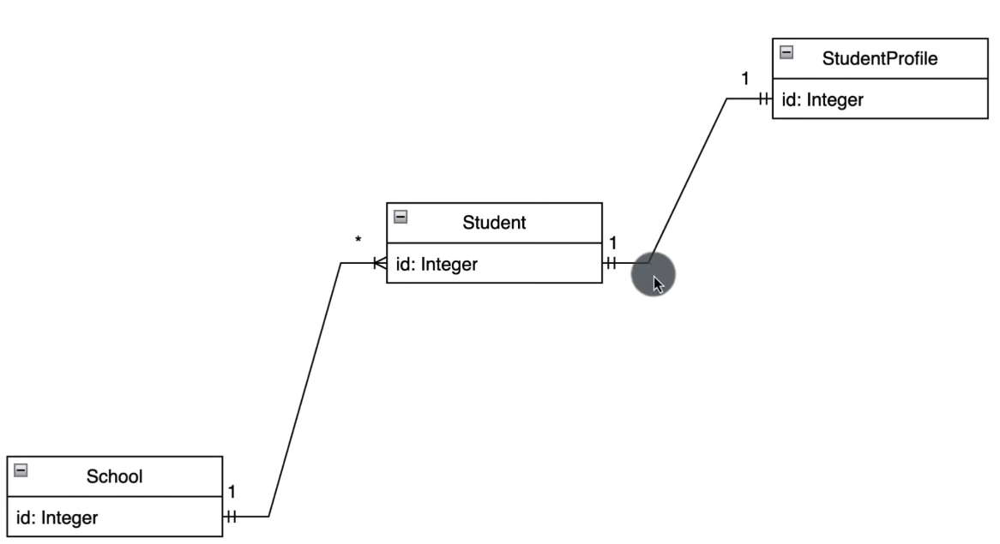
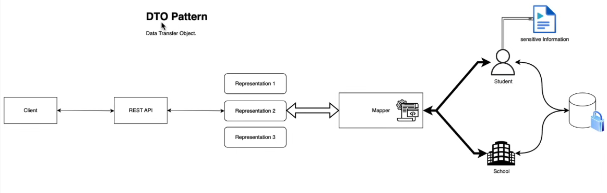

## Advanced Springboot with relationships in JPA using Java-Maven for FCC Course of Springboot

#### RelationShip Mapping

- Here, School is Parent of Student, and Student is Parent of StudentProfile while defining relationships

### Defining JPA Relationships

- See Student.java and StudentProfile.java to see `@OneToOne` Reltionship definition i.e Each Student has a StudentProfile

- See School.java and Student.java to see `@OneToMany` and `@ManyToOne` Relationship definition as School has one to many relationship with Students i.e School has many Students

### How to Avoid Infinite Recursion while inserting data after relationship mapping

**USING Jackson Annotations**

- School is **PARENT** of Student, so we add `@JsonManagedReference` in School.java where List of Stidents is defined which causes infinite recursion between Student and School, because student also has School defined.  This annotation means that Parent is responsible for serializing the child and child cannot serialize parent.

- Since Student is **CHILD** of School, we use `@JsonBackReference` annotation in Student.java where School is instantiated. This means that Student entity/object doesnt need to serialize its parent i.e School

Now using this, we need to provide a lot of overhead and makes our Student object more and more complex. To overcome this, we use `DTO` which is the **Data Transfer Object Pattern**

### DTO i.e Data Transfer Object

- We want to hide sensitive information from outside world, hence we introduce a service or `mapper` which helps hide that information like password, email, phone number, etc. Using a mapper, we can have multiple representations of an entity
- So, to demonstrate DTO, we create a StudentDto Record, which contains name, email, and schoolId. We can add it into persistence DB by posting req on the url passing DTO object instead of student object
- See **Postman Collection** to undestand output of different APIs based on DTO or non-DTO. When running for **First time**, run `PostSchool/PostSchoolDto`, `PostStudent/PostSchoolDto`, and then run other commands like `Get, Delete, etc`

### Methods to Run the Code

#### 1. To run the application:

1. Install the `.jar` file from `packages` on gitub

2. After Installing use java command run the generated SNAPSHOT.jar file - `java -jar NAME_OF_FILE.jar`

#### 2. To run the code(Using Maven):

1. Install the dependencies needed to run the application and also downloading SNAPSHOT of production application - `mvn install`

2. After Installing using java command run the generated SNAPSHOT.jar file - `java -jar .\target\demo-0.0.1-SNAPSHOT.jar`

#### 3. To run the local springboot application:

1. Directly run the `DemoApplication.java` to locally run the code and to publish changes as well

### Steps for Springboot:

1. After extracting from Spring Initializr, comment JPA until repository is not implemented
2. Use `@RestController` and `@RequestMapping` for defining path in Controller File.
3. Use `@Service` to set Service file as Service Func.
4. Use `@Autowired` in both Controller and Service for Dependency Injection
5. For Table in DB, use `@Table` and `@Entity` and use necessary generators for different variables.
6. Use `@Repository` in repository file
7. in Config file, use `@Configuration` on class and `@Bean` for method to add initial values in DB when running command
8. If we use `spring.jpa.hibernate.ddl-auto=create-drop`, then there is need for Config, else use, `...=update`, to dont delete the DB Details when application reloads

### To Upload Package on GitHub:

1. Change the REPOSITORY on `/{user}/.m2/settings.xml` and add `OWNER` and `GITHUB_TOKEN`
2. Add `Distrbution Management` in `pom.xml`
